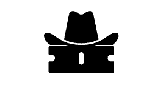
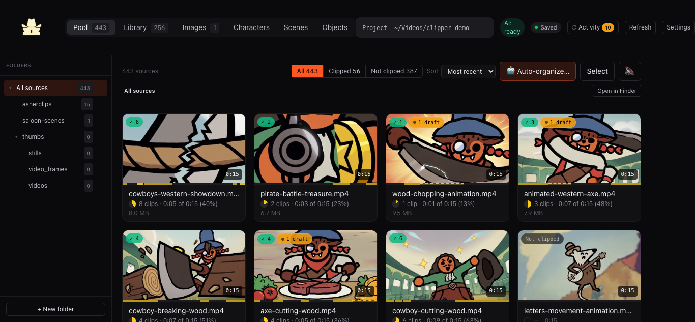
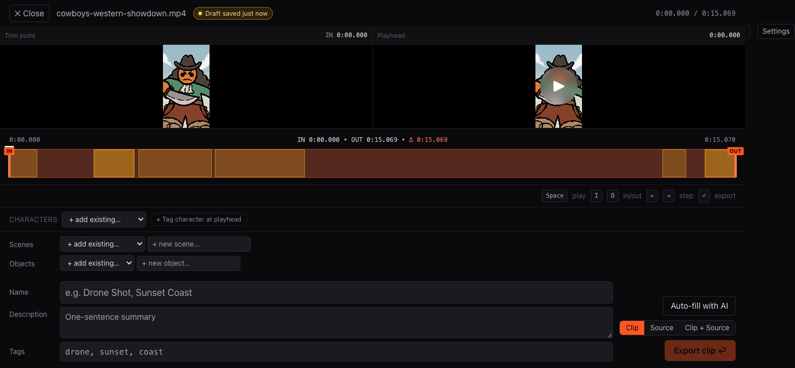
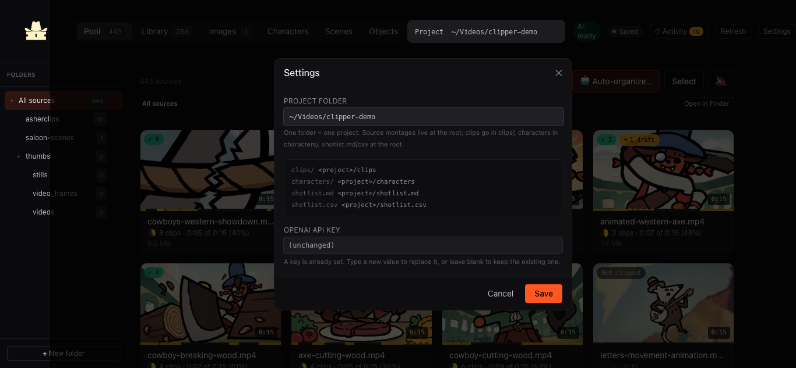

<p align="center">
  
</p>

# Clipper Cowboy

> Build a living shot library for your characters, worlds, and stories.

When you are building an IP, good moments cannot disappear into a pile of raw
generations. Clipper Cowboy turns those montages into a local, searchable
library of ready-to-use shots—organized around the characters, scenes, objects,
and visual language you are building.

<p align="center">
  
</p>

<p align="center">
  <a href="#quick-start">Quick start</a> ·
  <a href="#how-it-fits-into-your-production">Production workflow</a> ·
  <a href="#privacy-and-security">Privacy</a> ·
  <a href="./CONTRIBUTING.md">Contributing</a>
</p>

| Review | Edit | Configure |
| --- | --- | --- |
|  |  |  |

## Build an IP, not another pile of files

- **Keep your cast and world available.** Tag clips with recurring characters,
  scenes, objects, and descriptive tags so a specific hero, saloon, prop, or
  background is always findable when you need another shot.
- **Turn generations into usable coverage.** Review long montage videos, carve
  out the seconds that work, and save them as named clips instead of trying to
  remember which source file held the good take.
- **Stay ready to make the next edit.** Search, filter, preview, and export a
  collection of matching shots for Premiere or another NLE—without rebuilding
  the same selects every time.

## What Clipper Cowboy does

### 1. Make selects from a growing source pool
- Scan a project folder of AI-generated source montages in one focused Pool.
- Set frame-accurate in/out points and see already-clipped regions on the
  source timeline, so you know what you have saved and what remains.
- Auto-save drafts so a 30-minute source can be cataloged over days instead of
  finished in one sitting.

### 2. Build a library around your world
- Give every keeper a name, description, tags, characters, scenes, and objects.
- Use reference images and optional AI assistance to keep recurring characters
  and visual settings consistently cataloged.
- Search or combine filters: “this character in this location with this prop”
  becomes a usable set of clips, not an excavation through folders.

### 3. Pull the right shots into the next piece
- Preview clips inline, select a set, and hand it to Premiere or export a
  curated NLE-ready folder or zip.
- Keep your stock of character, environment, action, and transition shots
  ready for the next episode, trailer, social cut, or pitch.
- Stream-copy keyframe-aligned interiors where possible; short trim edges may
  be losslessly re-encoded to preserve precise cuts.

### 4. Use AI as an assistant, not the owner
- Optional OpenAI-assisted labels and reference-frame recognition help with
  cataloging; you keep the final decision on every select and export.
- The app stays useful with no API key, and all media plus catalog sidecars stay
  in your project folder.

## Quick start

**Requirements:** Node 20+ (Node 22 recommended). `ffmpeg` and `ffprobe` are
bundled through [`ffmpeg-static`][ffmpeg-static] and
[`ffprobe-static`][ffprobe-static].

1. Clone this repository and enter it.
2. Run the local setup:

   ```bash
   npm run setup
   ```

3. Start the development app:

   ```bash
   npm run dev
   ```

Open <http://localhost:5173>. The first-run wizard creates or selects a project
folder and can optionally save an OpenAI key locally; clip review, cataloging,
and export work without a key.

For a single local server after a build:

```bash
npm start
# open http://localhost:47474
```

### macOS convenience launcher

`Clip Cataloger.command` is a **macOS-only** Finder launcher. It installs
dependencies when needed, builds stale UI assets, starts the local server, and
opens the browser. If Gatekeeper prompts, right-click the file and choose
**Open**. This convenience behavior is not a cross-platform installer.

## How it fits into your production

Clipper Cowboy is the visual memory for a project: the place where your best
shots become organized building blocks instead of one-off generations. The
browser UI is for hands-on review, cataloging, and selection. The included local
MCP server can also let Codex and other compatible agents inspect sources,
search clips, update metadata, export clips, and request explicitly confirmed
OpenAI analysis. Start with the [MCP guide](./mcp/README.md).

Optional integrations support that core workflow. For example, Clipper Cowboy
can hand a completed clip to the official Stem Studio MCP server for local audio
separation; it does not bundle Stem Studio or exchange credentials. Read the
[Stem Studio integration guide](./docs/INTEGRATIONS.md) for setup and lifecycle
limits.

## Privacy and security

Clipper Cowboy is local-first: the API binds to `127.0.0.1`, media and sidecar
metadata live in your project folder, and no hosted account is required. OpenAI
features are optional and require an explicit configured key; MCP analysis
requires confirmation before sampled frames leave the machine. Do not expose the
local API through a tunnel or reverse proxy. See [SECURITY.md](./SECURITY.md).

## Project status

Clipper Cowboy is a working local-first beta, not a hosted SaaS. Contributions,
bug reports, and thoughtful workflow feedback are welcome; see
[CONTRIBUTING.md](./CONTRIBUTING.md) and [SUPPORT.md](./SUPPORT.md).

## Detailed reference

### Configuration

Security-first defaults:

- **No API keys are committed in this repository.**
- `OPENAI_API_KEY` is optional; without it, AI features are disabled while core
  review, editing, cataloging, and export workflows continue.
- Settings save local configuration to an ignored `.env` file.
- The API binds to `127.0.0.1`; do not expose it through a tunnel or reverse
  proxy.

| Variable | Required | Description |
| --- | --- | --- |
| `PROJECT_DIR` | no | Project folder. Defaults to `~/ClipCataloger`. |
| `OPENAI_API_KEY` | no | Optional GPT-4o calls for captioning and recognition. |
| `PORT` | no | Production server port. Defaults to `47474`. |
| `CLIPPER_STEM_STUDIO_ROOT` | no | Trusted local Stem Studio checkout. |
| `CLIPPER_STEM_STUDIO_PYTHON` | no | Optional Stem Studio Python override. |
| `CLIPPER_STEM_STUDIO_CACHE` | no | Optional Stem Studio model-cache override. |
| `CLIPPER_STEMS_TIMEOUT_MINUTES` | no | Per-job safety timeout; defaults to 360 minutes. |

See [`.env.example`](./.env.example) for the documented placeholder template.

### Background audio stems

Choose **Split audio stems** on a **Clip** or **Clip + Source** export. The
first use opens local setup; select a trusted Stem Studio checkout and finish
its own dependency setup if needed. Clipper processes one local job at a time
and publishes verified outputs under
`PROJECT_DIR/derived/stems/`; a stem failure does not invalidate the clip
export. No hosted key is required for separation, and Clipper does not forward
its OpenAI key or local API token to Stem Studio.

Fast is the default automatic recommendation. High is recommended for capable
hardware. Max uses Stem Studio's additional MVSEP model and is an explicit user
choice because its upstream licensing needs separate review. See
[docs/INTEGRATIONS.md](./docs/INTEGRATIONS.md).

### Architecture

1. **Import / indexing** — select `PROJECT_DIR`; Clipper scans source video and
   writes project-local sidecar state.
2. **Review loop** — use the React UI to annotate shots and adjust ranges.
3. **Optional AI pass** — server-side OpenAI calls run only when configured.
4. **Export pipeline** — a keyframe-aware exporter writes accepted clips to
   `clips/`.
5. **Catalog persistence** — clips, entities, drafts, and activity live in
   `.clipcataloger/` inside the project.

- **Frontend (`src/`)**: Vite + React 18 + Tailwind UI.
- **Backend (`server/`)**: Express API, local filesystem operations, and ffmpeg
  orchestration.
- **Platform notes**: macOS, Linux, and Windows are supported by the core
  stack. `Reveal in Finder` and APFS clonefile bundle exports are macOS-only;
  cross-platform polish is still welcome.

## Hotkeys

### Editor

| Key            | Action                                   |
| -------------- | ---------------------------------------- |
| `Space`        | Play / pause                             |
| `J` / `K` / `L`| Reverse / pause / forward (1×)           |
| `I` / `O`      | Set in / out at current playhead         |
| `←` / `→`      | Step one frame (hold `Shift` for 10)     |
| `Enter`        | Export the current selection             |
| `Esc`          | Close the editor                         |

Inside a text input, `Enter` only triggers export when held with `⌘` /
`Ctrl`, so you can type tags freely.

## How exports work

Clipper Cowboy's exporter probes each source for keyframe positions, then:

1. **Both endpoints already land on keyframes** → single
   `ffmpeg -ss in -to out -c copy`.
2. **Otherwise** → up to three segments are concatenated: a head re-encoded
   `[in .. nextKeyframe]`, the middle stream-copied `[..]`, and a tail
   re-encoded `[prevKeyframe .. out]`. The re-encode uses lossless settings
   matched to the source codec (`libx264 -qp 0` for H.264, `libx265
   lossless=1` for HEVC, `prores_ks` for ProRes). Audio is re-encoded only on
   the edge segments.

The exporter preserves frame-accurate in/out points. It stream-copies a
keyframe-aligned interior when available; trim edges may be losslessly
re-encoded, so an export should not be described as bit-identical as a whole.

For "Source" and "Clip + Source" bundle modes, the source is copied with
`cp -c` (APFS `clonefile(2)`) on macOS — instant, zero data written,
copy-on-write. Falls back to a regular byte copy on non-APFS volumes.

## Project structure

```
clipper-cowboy/
├── server/             # Express + ffmpeg backend (tsx watch in dev)
│   ├── routes/         # /api endpoints
│   ├── smartcut.ts     # keyframe-aware lossless export
│   └── config.ts       # env + on-disk paths
├── mcp/                # Standalone stdio MCP server for agents
├── src/                # Vite + React + Tailwind frontend
│   ├── views/          # Pool, Library, Editor, Onboarding, Settings…
│   ├── components/     # Video player, timeline, meta form…
│   └── lib/            # API client, save-state store, hooks
├── public/             # static assets (logo.png UI mask; optional logo.svg for Dock)
├── docs/BRAND-ASSETS.md # logo paths, icon build, Finder cache — read before changing brand files
└── .clip-server.mjs    # esbuild bundle of the server (gitignored)
```

A project folder on disk looks like this:

```
PROJECT_DIR/
├── *.mp4                       # source montages at root (the "pool")
├── clips/                      # exported clips (the "library")
│   Cartoon_Band_Performing.mp4
├── characters/                 # character library
│   Buck/character.json + refs/
├── derived/stems/              # external Stem Studio outputs (not re-imported)
├── shotlist.md                 # human-readable index
├── shotlist.csv                # machine-readable index
└── .clipcataloger/             # caches + sidecars (safe to delete)
```

> **Note on the `.clipcataloger/` folder name**: it's kept that way on
> purpose. Renaming would orphan existing users' drafts, captions, and
> activity logs. The branded app name is "Clipper Cowboy"; the sidecar
> folder name is just a stable identifier from the project's earlier life
> as "clip-cataloger".

## Contributing

PRs welcome. See [`CONTRIBUTING.md`](CONTRIBUTING.md) for how to get a dev
loop running and what we're looking for.

## License

[MIT](LICENSE).

## Credits

Built with:

- [`ffmpeg-static`][ffmpeg-static] + [`ffprobe-static`][ffprobe-static] —
  bundled ffmpeg binaries so users don't need a system install.
- [`openai`](https://github.com/openai/openai-node) — GPT-4o vision for clip
  captioning + character recognition.
- [Vite](https://github.com/vitejs/vite) +
  [React](https://github.com/facebook/react) +
  [Tailwind CSS](https://github.com/tailwindlabs/tailwindcss) for the frontend.
- [Express](https://github.com/expressjs/express) +
  [tsx](https://github.com/privatenumber/tsx)
  for the backend.

[ffmpeg-static]: https://github.com/eugeneware/ffmpeg-static
[ffprobe-static]: https://github.com/eugeneware/ffprobe-static
