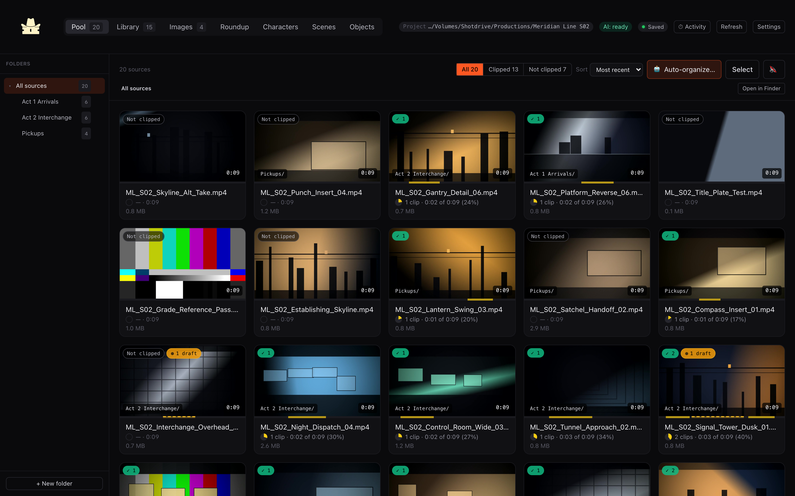

# Clipper Cowboy landing site

This folder is a self-contained static marketing site. It has no build step and no runtime dependencies.

## Preview locally

From the repository root:

```sh
python3 -m http.server 4173 --directory site
```

Then open [http://localhost:4173](http://localhost:4173).

## Live address

The site is built to be served from the default GitHub Pages address for this
repository:

```
https://princezoho.github.io/clipper-cowboy/
```

That URL is set as the canonical link and in the Open Graph and Twitter tags in
`index.html`. All asset paths are relative, so the site also works from a root
domain or any other subdirectory without edits.

## Deploy

`.github/workflows/deploy-landing.yml` is manual-only and publishes this folder.
Before the first run, someone with repository admin access must do the one-time
account step:

1. Repository **Settings > Pages**, set **Source** to **GitHub Actions**.
2. Open the **Actions** tab and run **Deploy landing site** with **Run workflow**.

Until step 1 is done the workflow fails at the Configure Pages step. Nothing in
this repository can enable Pages on its own.

The contents of `site/` can also be dropped on any other static host, including
Cloudflare Pages, Netlify, or existing Jeje Studios hosting.

## Moving to clippercowboy.jejestudios.com later

The site does not ship a `CNAME` file, because committing one while DNS still
points elsewhere would break the working default Pages URL.

`clippercowboy.jejestudios.com` currently answers with `A` records in the
`216.150.x.x` range (Vercel), not GitHub Pages, so it has to be repointed first.
Verify what is live before changing anything:

```sh
dig +short clippercowboy.jejestudios.com A CNAME
```

Because this is a subdomain, a single `CNAME` record is all that is needed:

| Type  | Name              | Value                    | TTL  |
| ----- | ----------------- | ------------------------ | ---- |
| CNAME | `clippercowboy`   | `princezoho.github.io.`  | 3600 |

Set that on the `jejestudios.com` zone, and remove any existing `A`, `AAAA`, or
`CNAME` record on the `clippercowboy` name first, since a `CNAME` cannot coexist
with other records at the same name.

Apex domains cannot use `CNAME`. Only if you ever serve the bare
`jejestudios.com` from Pages would you instead need these four `A` records plus
four `AAAA` records:

| Type | Name | Value            |
| ---- | ---- | ---------------- |
| A    | `@`  | `185.199.108.153` |
| A    | `@`  | `185.199.109.153` |
| A    | `@`  | `185.199.110.153` |
| A    | `@`  | `185.199.111.153` |

| Type | Name | Value                  |
| ---- | ---- | ---------------------- |
| AAAA | `@`  | `2606:50c0:8000::153`  |
| AAAA | `@`  | `2606:50c0:8001::153`  |
| AAAA | `@`  | `2606:50c0:8002::153`  |
| AAAA | `@`  | `2606:50c0:8003::153`  |

Once DNS resolves, enter the domain in **Settings > Pages > Custom domain**.
GitHub commits the `CNAME` file itself at that point. Wait for the TLS
certificate to be issued, then enable **Enforce HTTPS**, and update the
canonical link and the `og:`/`twitter:` URLs in `index.html` to the new domain.

Verify the record with:

```sh
dig +short clippercowboy.jejestudios.com CNAME
```

## Assets

Product screenshots live in `site/media/`. All three are captured against the
fully synthetic "Meridian Line S02" sample project, so nothing on this page
shows real footage, real filenames, or a real filesystem path.

| File            | Section              | Dimensions | PNG     | WebP    |
| --------------- | -------------------- | ---------- | ------- | ------- |
| `hero-pool`     | hero and chapter 01  | 3200x2000  | 1175 KB | 274 KB  |
| `hero-editor`   | chapter 02           | 3200x2160  | 674 KB  | 176 KB  |
| `hero-library`  | chapter 03           | 3200x2000  | 884 KB  | 262 KB  |

Each one ships as both `.webp` and `.png` and is wired up with `<picture>`:

```html
<picture>
  <source srcset="./media/hero-pool.webp" type="image/webp" />
  
</picture>
```

Every browser in the support matrix takes the WebP, so the PNGs cost no
bandwidth. They are kept because the `og:image` and `twitter:image` cards point
at `hero-pool.png`, since some social crawlers still reject WebP, and because a
text-only page would be a poor failure mode if a client ever did skip it.

The hero image loads eagerly and is preloaded. The three below the fold use
`loading="lazy"`. Every `img` carries `width` and `height` so the layout does
not shift, which is why `img { height: auto }` is in `styles.css`.

`logo.png` is the brand mark in the header.

The same screenshots are also kept in `docs/screenshots/` for the repository
README.

## Typography

The brand faces are self-hosted from `site/media/fonts/` and are committed to
the repository under licenses the project owner has confirmed cover this use:

| Face                     | Role                        | woff2  | Original `.otf` |
| ------------------------ | --------------------------- | ------ | --------------- |
| Wantedo                  | display headings            | 106 KB | 337 KB          |
| Adobe Garamond Pro Bold  | body copy                   | 41 KB  | 75 KB           |

Each `@font-face` lists the `woff2` first and the original `.otf` as a fallback,
with `font-display: swap`. Neither face is subsetted, so the full glyph set
ships and accented characters and punctuation are preserved.

Regenerate the `woff2` files after replacing a source font:

```sh
python3 -m venv /tmp/fontenv
/tmp/fontenv/bin/pip install fonttools brotli
/tmp/fontenv/bin/python - <<'PY'
from fontTools.ttLib import TTFont
for src, out in (("Wantedo.otf", "Wantedo.woff2"), ("Garamond.otf", "Garamond.woff2")):
    font = TTFont(f"site/media/fonts/{src}")
    font.flavor = "woff2"
    font.save(f"site/media/fonts/{out}")
PY
```

Interface labels, buttons, and code samples intentionally use a system
sans-serif stack. The arrow and bullet characters used in those labels are not
present in either brand face, so keeping them in the sans stack avoids a
per-character fallback.
